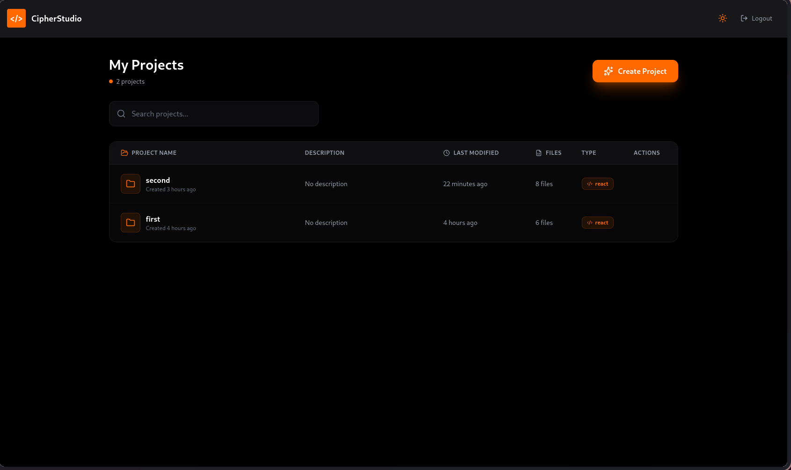
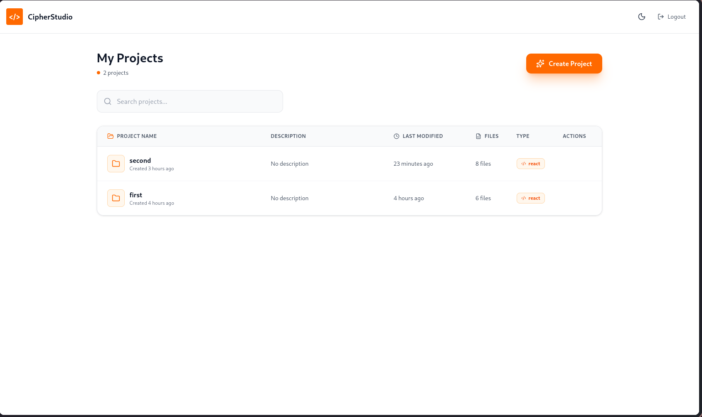
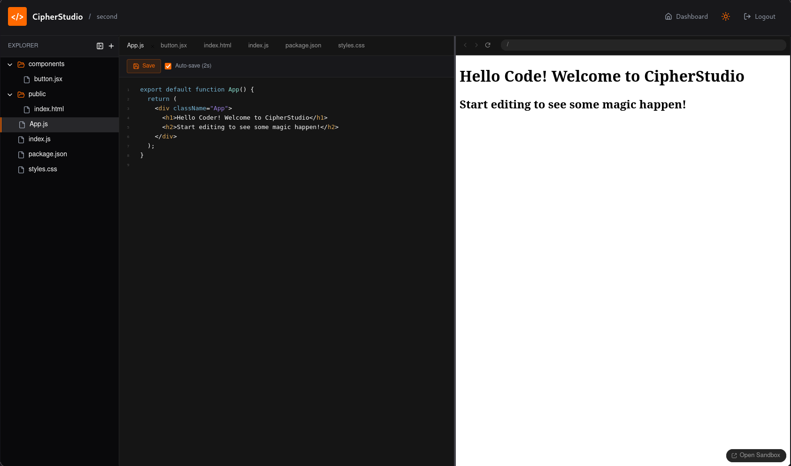
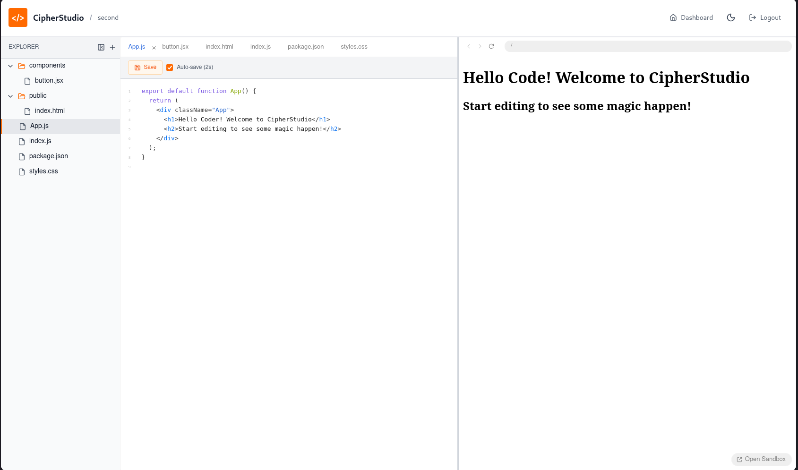

# CipherStudio - Web-Based IDE

A full-stack web-based IDE application with React frontend and Node.js backend.

# Screenshots

## Dashboard



## Editor



## Project Structure

```
cipherschool-assignment/
├── ide/           # React frontend
└── server/        # Node.js backend
```

## Quick Setup

### Backend Setup

1. Navigate to server directory:
```bash
cd server
```

2. Install dependencies:
```bash
npm install
```

3. Create `.env` file:
```bash
cp .env.example .env
```

4. Update `.env` with your credentials:
```env
MONGODB_URI=your_mongodb_uri
JWT_SECRET=your_secret_key
AWS_ACCESS_KEY_ID=your_aws_key
AWS_SECRET_ACCESS_KEY=your_aws_secret
AWS_S3_BUCKET_NAME=your_bucket_name
```

5. Start the server:
```bash
npm run dev
```

Server runs on: http://localhost:5000

### Frontend Setup

1. Navigate to ide directory:
```bash
cd ide
```

2. Install dependencies:
```bash
npm install
```

3. Create `.env` file:
```bash
cp .env.example .env
```

4. Start the development server:
```bash
npm run dev
```

Frontend runs on: http://localhost:5173

## Features

### Backend
- User authentication (Register/Login)
- JWT-based authorization
- Project CRUD operations
- File/folder management with nested structure
- AWS S3 integration for file storage
- MongoDB for data persistence

### Frontend
- User authentication UI
- Project dashboard
- Code editor with Sandpack
- File tree explorer
- Theme toggle (Dark/Light)
- Responsive design

## Tech Stack

**Frontend:**
- React 19
- Vite
- React Router
- Axios
- Sandpack (Code Editor)
- Tailwind CSS
- Lucide Icons

**Backend:**
- Node.js
- Express.js
- MongoDB & Mongoose
- JWT Authentication
- AWS S3
- bcryptjs

## API Endpoints

### Authentication
- `POST /api/users/register` - Register user
- `POST /api/users/login` - Login user
- `GET /api/users/profile` - Get user profile (Protected)

### Projects
- `POST /api/projects` - Create project (Protected)
- `GET /api/projects` - Get all projects (Protected)
- `GET /api/projects/:id` - Get project by ID (Protected)
- `PUT /api/projects/:id` - Update project (Protected)
- `DELETE /api/projects/:id` - Delete project (Protected)

### Files
- `POST /api/files` - Create file/folder (Protected)
- `GET /api/files/:id` - Get file by ID (Protected)
- `GET /api/files/project/:projectId` - Get files by project (Protected)
- `PUT /api/files/:id` - Update file (Protected)
- `DELETE /api/files/:id` - Delete file (Protected)

## Running Both Servers

Terminal 1 (Backend):
```bash
cd server
npm run dev
```

Terminal 2 (Frontend):
```bash
cd ide
npm run dev
```

## Environment Variables

### Backend (.env)
```
NODE_ENV=development
PORT=5000
MONGODB_URI=mongodb://localhost:27017/cipherstudio
JWT_SECRET=your_jwt_secret
JWT_EXPIRE=30d
AWS_ACCESS_KEY_ID=your_aws_key
AWS_SECRET_ACCESS_KEY=your_aws_secret
AWS_REGION=us-east-1
AWS_S3_BUCKET_NAME=your_bucket_name
```

### Frontend (.env)
```
VITE_API_URL=http://localhost:5000/api
```

## Notes

- Make sure MongoDB is running before starting the backend
- AWS S3 credentials are required for file storage
- Default ports: Backend (5000), Frontend (5173)

## License

ISC
